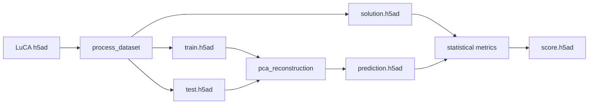

# ReconEval OpenProblems integration

Viash components for benchmarking **gene expression reconstruction** following the
[OpenProblems](https://openproblems.bio) task structure.

## Pipeline overview



| Stage | Component | Description |
|-------|-----------|-------------|
| 1. Data processing | `data_processors/process_dataset` | Normalize, HVG selection, train/test split |
| 2. Methods | `methods/pca_reconstruction` | PCA encode/decode baseline |
| 2. Methods | `methods/autoencoder` | Fully-connected AE (PyTorch) |
| 2. Methods | `methods/scvi` | scvi-tools SCVI denoised expression |
| 2. Control | `control_methods/ground_truth` | Copies solution (pipeline QC) |
| 3. Metrics | `metrics/statistical`, `metrics/biological`, `metrics/knn_purity` | ReconEval scores |

## Quick demo (LuCA)

Runs download → process → PCA reconstruction → statistical metrics without Viash:

```bash
# From repository root
python -m venv .venv && source .venv/bin/activate
pip install -r envs/requirements-min.txt
pip install -e .

# Demo with synthetic fallback (no Census download)
python openproblems/scripts/run_demo_luca.py --fallback --n-cells 2000

# Demo with real LuCA subset from CELLxGENE Census
pip install cellxgene-census
python openproblems/scripts/run_demo_luca.py --n-cells 3000
```

LuCA collection:
[Human Lung Cancer Cell Atlas](https://cellxgene.cziscience.com/collections/edb893ee-4066-4128-9aec-5eb2b03f8287)

## Full OpenProblems workflow (Viash + Nextflow)

Requires Viash 0.9.4, Nextflow, and Docker. The Docker images `pip install`
ReconEval from `github.com/r-sayar/ReconEval`, so build from a clone of that
repo. Three settings below are **required** and easy to miss — see the notes.

```bash
cd openproblems

# 1. Download a LuCA subset from CZ CELLxGENE Census (memory-safe sampling)
python scripts/download_luca.py --n-cells 20000 \
  --output resources_test/common/luca/dataset.h5ad

# 2. Build all components (Docker images + Nextflow modules)
viash ns build --setup cachedbuild

# 3. Split into train/test/solution
target/executable/data_processors/process_dataset/process_dataset \
  --input resources_test/common/luca/dataset.h5ad --n_hvg 2000 \
  --output_train    resources_test/reconeval/luca/train.h5ad \
  --output_test     resources_test/reconeval/luca/test.h5ad \
  --output_solution resources_test/reconeval/luca/solution.h5ad

# 4. The workflow needs this shared OpenProblems util image (not built by ns build)
docker pull ghcr.io/openproblems-bio/openproblems/utils/extract_uns_metadata:build_main

# 5. Run the benchmark. NXF_VER pins a compatible Nextflow; add `laptop` to the
#    profile on a small machine (see notes).
NXF_VER=24.10.5 nextflow run . \
  -main-script target/nextflow/workflows/run_benchmark/main.nf \
  -profile docker,laptop --id luca \
  --input_train    resources_test/reconeval/luca/train.h5ad \
  --input_test     resources_test/reconeval/luca/test.h5ad \
  --input_solution resources_test/reconeval/luca/solution.h5ad \
  --output_scores score_uns.yaml --publish_dir output/luca
# Scores: output/luca/score_uns.yaml
```

**Required-but-easy-to-miss settings**

- **`NXF_VER=24.10.5`** — Nextflow 26.x rejects the Viash-generated config
  (`tempDir` is undefined); pin a 24.10.x runtime.
- **`-profile docker,laptop`** — component labels request HPC-sized resources
  (up to 30 CPU / 100 GB). On a workstation the `laptop` profile (in
  `nextflow.config`) clamps them; omit it on an HPC node with enough resources.
- **`docker pull …/extract_uns_metadata:build_main`** — a remote OpenProblems
  dependency image the workflow uses but `viash ns build` does not fetch.

## h5ad dataloader

Training methods use `H5adReconstructionDataModule` from `sc_reconstruction.dataloaders`:

```python
from sc_reconstruction.dataloaders import H5adReconstructionDataModule

dm = H5adReconstructionDataModule(
    train_path="train.h5ad",
    test_path="test.h5ad",
    layer="X",
)
dm.prepare_data()
X_train = dm.get_train_matrix()
```

## Contributing to OpenProblems

1. Copy or symlink `openproblems/src/` into a task repository under `openproblems-bio/`.
2. Register metrics in `workflows/run_benchmark/config.vsh.yaml`.
3. Open a PR following [Add a metric](https://openproblems.bio/documentation/create_component/add_a_metric).

See also the main [ReconEval documentation](https://reconeval.readthedocs.io).
